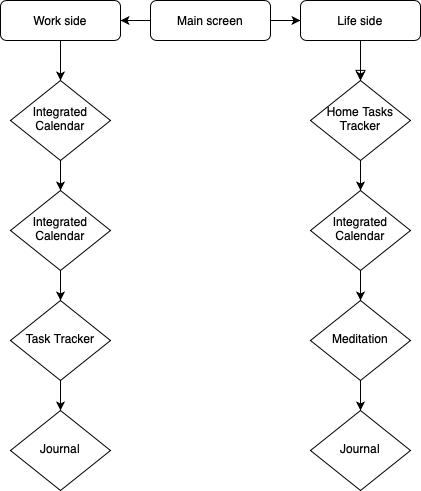

# Your Work&Lifeplace

W&L - це мобільний додаток, створений для впорядкування, організації та відслідковування робочих і домашніх справ, а також для підтримки ментального і фізичного розвитку. Додаток складається з двох “сторін”: робочої та життєвої, кожна з яких пропонує спеціалізовані інструменти та функції.

**W-side** - допомагає користувачам організувати та відстежувати свої робочі задачі, підвищуючи продуктивність та ефективність.

**L-side** - забезпечує користувачам інструменти для організації домашніх справ, підтримки ментального та фізичного здоров'я.

**Інструменти:**
- Інтегрований календар
- Трекер завдань і справ
- Ведення щоденника
- Інтегрована медитація та ментальне здоров'я
- Простий і функціональний інтерфейс

**Підходить для:**
- фрілансерів
- професіоналів з гнучким графіком
- менеджерів та офісних працівників
- домашніх господарок та батьків

 **Схема додатку:**

